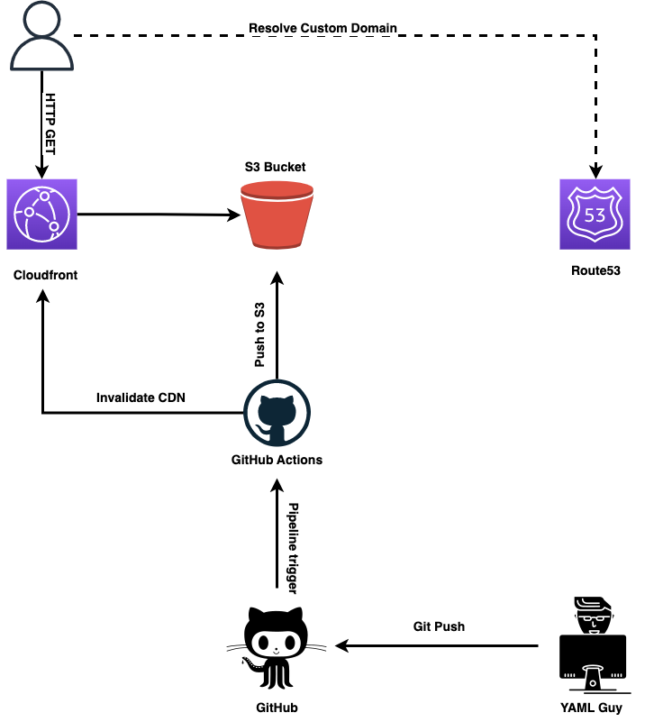

# personal-website-iac
Infrastracture as code repository for my personal website, you can find more information here -> [How to deploy your own website on AWS with Terraform and Git Hub Actions!](https://ettoreciarcia.com/posts/01-iac-and-pipeline-my-personal-website/)

## Infrastructure Overview
